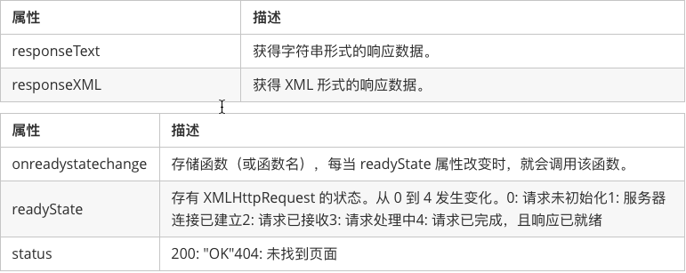

## 复习DOM（文档对象模型）

#### DOM节点有哪些？

* DOM节点一共有十二种类型，最常用的有
  * Element(元素节点)
  * Attr（属性节点）
  * Text（文本节点）

#### DOM操作

* DOM查询（获取）

  * 获取元素节点

    * ```document.querySelector()
      document.querySelector()
      ```

    * ```
      document.querySelectorAll ()
      ```

  * 获取属性节点

    * ```
      element.getAttribute()
      ```

  * 获取文本节点

    * ```
      element.innerText
      ```

    * ```
      elemnet.textContent
      ```

    * ```
      element.firstChild.nodeValue
      ```

  * innerHTML , outerHTML, innerText 的区别

* DOM创建与添加

  * 创建，添加元素节点

    * ```
      document.createElement(ele)
      ele.appendChild(ele)
      parentElement.insertBefore(newElement, referenceElement)
      ```

  * 创建属性节点

    * ```
      el.setAttribute('class', 'haha')
      ```

  * 创建文本节点

    * ```
      document.createTextNode（）
      ```

* DOM修改

  * ```
    element.replaceChild(ele1, ele2)
    ```

* DOM删除

  * ```
    element.removeChild() //删除节点
    ```

  * ```
    element.removeAttribute('class') //删除属性
    ```

#### DOM事件（事件监听）

事件是HTML文档执行某种操作时需要执行的动作，如：`click`、`load`和`mouseover`等都是事件的名字，响应事件的函数就叫做事件处理程序，又叫做事件监听器。

* [事件类型](https://developer.mozilla.org/zh-CN/docs/Web/Events)


* DOM 0级事件处理程序

  * DOM 0级事件处理程序是将一个函数赋值给一个事件处理程序属性，而通过将事件处理程序设置为null删除绑定在元素上的事件处理程序。这种方法无法给一个事件添加多个事件处理程序,后面的程序会覆盖前面的程序。


  * 在DOM 0级事件处理程序，事件名以`'on'`开头，因此`click`事件的事件处理程序就是`onclick`、`load`事件的事件处理程序就是`onload`。

  ```
  // 添加事件处理程序
  var btn=document.querySelector("#btn");
  btn.onclick=function () {
  	alert(this.id);
  }
  // 删除事件处理程序
  btn.onclick=null;;
  ```

* DOM 2级事件处理程序

  * DOM 2级定义了`addEventListener()`和`removeEventListener()`用于处理指定和删除事件处理程序。所有DOM节点都包含这两个方法，并且它们都接受3个参数，要处理的事件名、作为事件处理程序的函数和一个布尔值。最后这个布尔值参数如果是true，表示在捕获阶段调用事件处理程序；如果是false，表示在冒泡阶段调用事件处理程序。
  * ​

  ```
  var btn=document.querySelector("#btn");
  var handler=function(){
  	alert(this.id);
  }
  // 指定事件处理程序
  btn.addEventListener("click",handler,false);
  // 删除事件处理程序
  btn.removeEventListener("click",handler,false);

  ```

* ### 冒泡与捕获

  * ### 

  * ### 

* ### 利用冒泡实现事件委托

  就是把一个元素响应事件（click、keydown......）的函数委托到另一个元素；

  一般来讲，会把一个或者一组元素的事件委托到它的父层或者更外层元素上，真正绑定事件的是外层元素，当事件响应到需要绑定的元素上时，会通过事件冒泡机制从而触发它的外层元素的绑定事件上，然后在外层元素上去执行函数。

* ### addEventListener和attachEvent(IE浏览器)的区别

  - **参数个数不相同**，这个最直观，addEventListener有三个参数，attachEvent只有两个，attachEvent添加的事件处理程序只能发生在冒泡阶段，addEventListener第三个参数可以决定添加的事件处理程序是在捕获阶段还是冒泡阶段处理（我们一般为了浏览器兼容性都设置为冒泡阶段）
  - **第一个参数意义不同**，addEventListener第一个参数是事件类型（比如click，load），而attachEvent第一个参数指明的是事件处理函数名称（onclick，onload）
  - **事件处理程序的作用域不相同**，addEventListener的作用域是元素本身，this是指的触发元素，attachEvent事件处理程序会在全局变量内运行，this是window，所以刚才例子才会返回undefined，而不是元素id
  - **为一个事件添加多个事件处理程序时，执行顺序不同**，addEventListener添加会按照添加顺序执行，而attachEvent添加多个事件处理程序时顺序无规律(添加的方法少的时候大多是按添加顺序的反顺序执行的，但是添加的多了就无规律了)，所以添加多个的时候，不依赖执行顺序的还好，若是依赖于函数执行顺序，最好自己处理，不要指望浏览器

## HTTP（HyperText Transfer Protocol）

HTTP是一种用于分布式、协作式和超媒体信息系统的应用层协议，是万维网的数据通信的基础， TCP/IP协议族的一个子集。

| 7    | **应用层**application layer  | 例如[HTTP](https://zh.wikipedia.org/wiki/HTTP)、[SMTP](https://zh.wikipedia.org/wiki/SMTP)、[SNMP](https://zh.wikipedia.org/wiki/SNMP)、[FTP](https://zh.wikipedia.org/wiki/FTP)、[Telnet](https://zh.wikipedia.org/wiki/Telnet)、[SIP](https://zh.wikipedia.org/wiki/SIP)、[SSH](https://zh.wikipedia.org/wiki/SSH)、[NFS](https://zh.wikipedia.org/wiki/NFS)、[RTSP](https://zh.wikipedia.org/wiki/RTSP)、[XMPP](https://zh.wikipedia.org/wiki/XMPP)、[Whois](https://zh.wikipedia.org/wiki/Whois)、[ENRP](https://zh.wikipedia.org/w/index.php?title=ENRP&action=edit&redlink=1) |
| ---- | ------------------------- | ---------------------------------------- |
| 6    | **表示层**presentation layer | 例如[XDR](https://zh.wikipedia.org/w/index.php?title=External_Data_Representation&action=edit&redlink=1)、[ASN.1](https://zh.wikipedia.org/w/index.php?title=Abstract_Syntax_Notation_1&action=edit&redlink=1)、[SMB](https://zh.wikipedia.org/wiki/%E6%9C%8D%E5%8A%A1%E5%99%A8%E6%B6%88%E6%81%AF%E5%9D%97)、[AFP](https://zh.wikipedia.org/wiki/Apple_Filing_Protocol)、[NCP](https://zh.wikipedia.org/w/index.php?title=NetWare_Core_Protocol&action=edit&redlink=1) |
| 5    | **会话层**session layer      | 例如[ASAP](https://zh.wikipedia.org/w/index.php?title=Aggregate_Server_Access_Protocol&action=edit&redlink=1)、[SSH](https://zh.wikipedia.org/wiki/SSH)、ISO 8327 / CCITT X.225、[RPC](https://zh.wikipedia.org/w/index.php?title=Remote_procedure_call&action=edit&redlink=1)、[NetBIOS](https://zh.wikipedia.org/wiki/NetBIOS)、[ASP](https://zh.wikipedia.org/wiki/AppleTalk)、[IGMP](https://zh.wikipedia.org/wiki/IGMP)、[Winsock](https://zh.wikipedia.org/wiki/Winsock)、[BSD sockets](https://zh.wikipedia.org/wiki/Berkeley_sockets) |
| 4    | **传输层**transport layer    | 例如[TCP](https://zh.wikipedia.org/wiki/%E4%BC%A0%E8%BE%93%E6%8E%A7%E5%88%B6%E5%8D%8F%E8%AE%AE)、[UDP](https://zh.wikipedia.org/wiki/User_Datagram_Protocol)、[TLS](https://zh.wikipedia.org/wiki/Transport_Layer_Security)、[RTP](https://zh.wikipedia.org/wiki/%E5%AE%9E%E6%97%B6%E4%BC%A0%E8%BE%93%E5%8D%8F%E8%AE%AE)、[SCTP](https://zh.wikipedia.org/wiki/%E6%B5%81%E6%8E%A7%E5%88%B6%E4%BC%A0%E8%BE%93%E5%8D%8F%E8%AE%AE)、[SPX](https://zh.wikipedia.org/wiki/Sequenced_packet_exchange)、[ATP](https://zh.wikipedia.org/wiki/AppleTalk)、[IL](https://zh.wikipedia.org/w/index.php?title=IL_Protocol&action=edit&redlink=1) |
| 3    | **网络层**network layer      | 例如[IP](https://zh.wikipedia.org/wiki/%E7%BD%91%E9%99%85%E5%8D%8F%E8%AE%AE)、[ICMP](https://zh.wikipedia.org/wiki/ICMP)、[IPX](https://zh.wikipedia.org/wiki/IPX)、[BGP](https://zh.wikipedia.org/wiki/BGP)、[OSPF](https://zh.wikipedia.org/wiki/OSPF)、[RIP](https://zh.wikipedia.org/wiki/RIP)、[IGRP](https://zh.wikipedia.org/wiki/IGRP)、[EIGRP](https://zh.wikipedia.org/wiki/EIGRP)、[ARP](https://zh.wikipedia.org/wiki/ARP)、[RARP](https://zh.wikipedia.org/wiki/RARP)、[X.25](https://zh.wikipedia.org/wiki/X.25) |
| 2    | **数据链路层**data link layer  | 例如[以太网](https://zh.wikipedia.org/wiki/%E4%BB%A5%E5%A4%AA%E7%BD%91)、[令牌环](https://zh.wikipedia.org/wiki/%E4%BB%A4%E7%89%8C%E7%8E%AF)、[HDLC](https://zh.wikipedia.org/wiki/HDLC)、[帧中继](https://zh.wikipedia.org/wiki/%E5%B8%A7%E4%B8%AD%E7%BB%A7)、[ISDN](https://zh.wikipedia.org/wiki/ISDN)、[ATM](https://zh.wikipedia.org/wiki/%E5%BC%82%E6%AD%A5%E4%BC%A0%E8%BE%93%E6%A8%A1%E5%BC%8F)、[IEEE 802.11](https://zh.wikipedia.org/wiki/IEEE_802.11)、[FDDI](https://zh.wikipedia.org/wiki/FDDI)、[PPP](https://zh.wikipedia.org/wiki/PPP) |
| 1    | **物理层**physical layer     | 例如[线路](https://zh.wikipedia.org/w/index.php?title=%E7%BA%BF%E8%B7%AF&action=edit&redlink=1)、[无线电](https://zh.wikipedia.org/wiki/%E6%97%A0%E7%BA%BF%E7%94%B5)、[光纤](https://zh.wikipedia.org/wiki/%E5%85%89%E7%BA%A4) |

* 与HTTP密切相关的协议：IP，TCP,  DNS

  - IP (Internet Protocol) :  IP是在TCP/IP协议族中网络层的主要协议，任务是仅仅根据源主机和目的主机的地址传送数据。为此目的，IP定义了寻址方法和数据报的封装结构。
    - IP地址：分配给网络上使用网际协议的设备的数字标签
  - TCP：传输控制协议, TCP层是位于[IP](https://zh.wikipedia.org/wiki/IP)层之上，[应用层](https://zh.wikipedia.org/wiki/%E5%BA%94%E7%94%A8%E5%B1%82)之下的中间层, 确保传输的可靠性
  - DNS: 域名系统（英文：Domain Name System，缩写：DNS）是互联网的一项服务。它作为将域名和IP地址相互映射的一个分布式数据库，能够使人更方便地访问互联网。

* 通信传输流

  ​


* URI与URL

  URI 是统一资源标识符，而 URL 是统一资源定位符， URL是URI的子集。

  URI在某一规则下能把一个资源独一无二地标识出来。

  URL表示资源在互联网上的位置。

* 客户端与服务端通过请求与响应的交换达成通信

  * 起始行
    报文的第一行就是起始行,在请求报文中用来说明要做些什么,在响应报文中说明出现了什么情况。

  * 首部字段

    起始行后面有零个或多个首部字段。每个首部字段都包含一个名字和一个值,为了便于解析,两者之间用冒号(:)来分隔。首部以一个空行结束。添加一个首部字段和添加新行一样简单。

  * 主体

    空行之后就是可选的报文主体了,其中包含了所有类型的数据。请求主体中包括 了要发送给 Web 服务器的数据;响应主体中装载了要返回给客户端的数据。起始行和首部都是文本形式且都是结构化的,而主体则不同,主体中可以包含任意 的二进制数据(比如图片、视频、音轨、软件程序)。当然,主体中也可以包含 文本。

    ​

  

  请求从客户端发出，服务端接收处理请求后返回响应

  ​

- 请求报文（请求报文与响应报文）

  - 起始行
    报文的第一行就是起始行,在请求报文中用来说明要做些什么,在响应报文中说明出现了什么情况。

  - 首部字段

    起始行后面有零个或多个首部字段。每个首部字段都包含一个名字和一个值,为了便于解析,两者之间用冒号(:)来分隔。首部以一个空行结束。添加一个首部字段和添加新行一样简单。

  - 主体

    空行之后就是可选的报文主体了,其中包含了所有类型的数据。请求主体中包括 了要发送给 Web 服务器的数据;响应主体中装载了要返回给客户端的数据。起始行和首部都是文本形式且都是结构化的,而主体则不同,主体中可以包含任意 的二进制数据(比如图片、视频、音轨、软件程序)。当然,主体中也可以包含 文本。


* HTTP方法

  * GET： 获取资源
  * POST： 传输主体实体
  * PUT： 传输文件
  * HEAD： 获得报文首部（一般用于确认URI的有效性及资源的更新时间）
  * DELETE： 删除指定资源
  * TRACE： 追踪路径
  * CONNECT： 要求用隧道协议请求代理

* 通信的建立——三次握手

  

  * 第一次握手：建立连接时，客户端发送syn包（syn=j）到服务器，并进入SYN_SENT状态，等待服务器确认；SYN：同步序列编号
  * 第二次握手：服务器收到syn包，必须确认客户的SYN（ack=j+1），同时自己也发送一个SYN包（syn=k），即SYN+ACK包，此时服务器进入SYN_RECV状态；
  * 第三次： 客户端收到服务器的SYN+ACK包，向服务器发送确认包ACK(ack=k+1），此包发送完毕，客户端和服务器进入ESTABLISHED（TCP连接成功）状态，完成三次握手。

  完成三次握手，客户端与服务器开始传送数据。这样就保证了，每次传送数据都会准确到达目标设备了。

* HTTP是一种无状态协议，不能对通信状态进行保存，每次新的请求都要建立新的连接


* 服务器响应之状态码

  状态码用来描述返回结果的情况，由一个三位数的数字和原因短语组成

  


## JSON

**JSON**（**J**ava**S**cript **O**bject **N**otation）是一种轻量级的数据交换语言，以文字为基础，且易于让人阅读。尽管JSON是Javascript的一个子集，但JSON是独立于语言的文本格式。

JSON 数据格式与语言无关，脱胎于 JavaScript，但目前很多编程语言都支持 JSON 格式数据的生成和解析。JSON 的官方 MIME 类型是 `application/json`，文件扩展名是 `.json`。

### JSON的编写

JSON 数据的书写格式是：名称/值对。

JSON 值可以是：

- 数字（整数或浮点数）
- 字符串（在双引号中）
- 布尔值（true 或 false）
- 数组
- 对象
- null

```
{
  "x": "xxx",
  "xx": [0, 1, 2],
  "xxx": 123,
  "xxxx": true,
  "xxxxx": {0: "json"}
}
```

* 注意跟JS对象的区别

#### 在Javascript中的转换

* 把JSON对象转换成JSON字符串

  ```
  JSON.stringify();//可传入三个参数，其中第一个参数必须有

  JSON.stringify(obj, replacer, space) //第二个参数可传入一个数组或者一个函数，用于筛选，处理输出。第三个参数可添加分割符号，增加可读性
  ```

* 把JSON字符串转换成JSON对象

  ```
  JSON.parse();//第二个参数可传入一个函数
  ```


## form表单

在web应用中，表单用来收集用户数据，并发送到服务端

所有的form表单都由一个form标签开始，内部是用户的输入控件与提交按钮

```
<form action="" method="" entype="">
	<input type="text" name="" value="" placeholder="">
	<input type="submit" name="" value="submit">
</form>
```

- `action` 属性定义了在提交表单时所收集的数据的位置(URL)

-  `method` 属性定义了发送数据的HTTP方法(GET或者POST)

- `entype`属性定义了发送数据的编码方式

  

form表单的弊端

* 服务器接收并处理传来的表单，会送回一个新的网页
* 请求是同步的，在收到服务器响应之前网页不能做其他操作

## AJAX (Asynchronous JavaScript and XML) 

### 怎么读？

##### [发音](https://forvo.com/word/ajax/)  /ˈeɪdʒæks/

### 什么是AJAX？

###### 异步的JavaScript与XML技术，指的是一套综合了多项技术的浏览器端网页开发技术。

### 作用

让前端与后台进行少量数据交换，使网页实现异步更新。可以在不重新加载整个网页的情况下，对网页的某部分进行更新。传统的网页（不使用 Ajax）如果需要更新内容，必须重载整个网页页面。

### AJAX的使用

1. 创建XMLHttpRequest对象

   ```
   var xhr = new XMLHttpRequest();
   var xhr = new ActiveXObject("Microsoft.XMLHTTP"); //IE5,IE6
   ```

2. 使用 XMLHttpRequest 对象的 open() 和 send() 方法向服务器发送请求

   ```
   xhr.open(method, URL, async); //异步时，async为true
   xhr.setRequestHeader("Content-type","text/plain"); //POST请求需要设置请求头
   xhr.send(data);//POST请求填写发送的数据，GET请求不填，或者写NULL
   ```

3. 处理服务器的响应

   

   ```
   xhr.onreadystatechange = function() {
     if (xhr.readyState === 4 && xhr.status === 200) {
           //响应成功后的操作
       }
   }
   ```

##### 理解什么是同步，什么是异步


